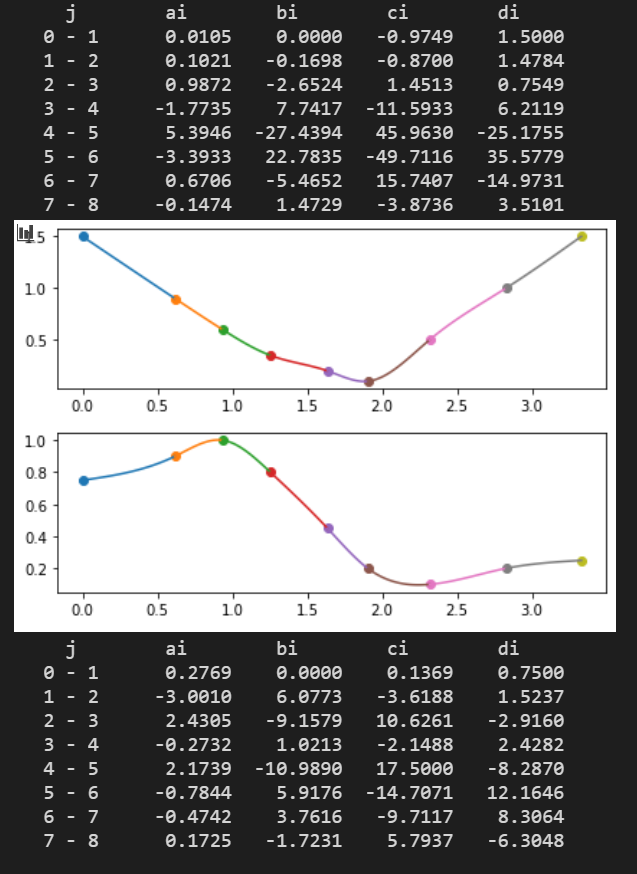

Splines with parallel execution by Numpy

Given some points, a common operation is to create a function that passes through all these points. This operation is called interpolation.

There are multiple strategies to interpolate and one of them is using Splines.

Splines are an ensemble of third-degree polynomials. Each polynomial connects two near points.

Besides the connection, the Splines also have two extra proprieties:

- In the point connecting two polynomials, the polynomials' **first** derivative are the same

- In the point connecting two polynomials, the polynomials' **second** derivative are the same

Thus we only need to solve a system of equations to define the value of each coefficient of each third-degree polynomial.

However, we will still need two more equations to be able to solve all equations deterministically. These two equations define the type of the Spline.

This project implemented the Natural Splines and its two extra conditions are that the second derivative of the first polynomial and the last polynomial is equal to zero in the extremes points (left-most point and right-most point among all points).

Visually, it means the function is very similar to a line near the first and the last points.

Since we need to solve a system of equations, we can use numpy to execute in a parallel fashion to do everything much, much faster.

# How to use

For now, you need to download the notebook (in Python) and manually change the input.

Then the program will show both the input interpolated and the coefficient of each polynomial, as we can see below.

